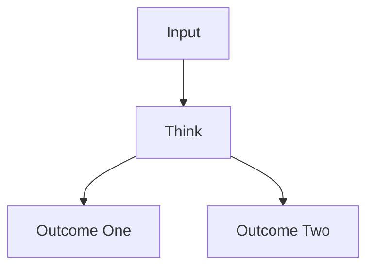
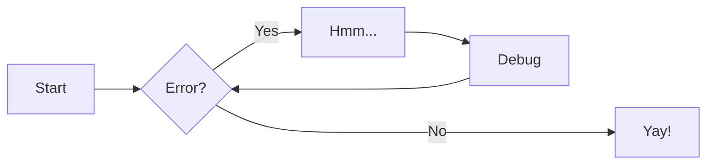

# Markdown Style Reference

This document is not a markdown tutorial. It's merely a guide to the features
available on this site. GITM's ReadTheDocs site is built using MkDocs and a
number of plugins. This takes the (relatively) vanilla Markdown of MkDocs and
extends its functionality.

To develop locally, one can simply install the Python requirements in
`srcDoc/requirements.txt` and then spin up a MkDocs server, previewing the
documentation live! It's very useful.

```bash
pip install -r srcDoc/requirements.txt
mkdocs serve
```

---

Table of contents can be inserted with

```markdown
[TOC]
```

For example (ensuring there are newlines before & after):

[TOC]

## General Syntax

Markdown can put *italics* and **bold** in really easily by surrounding the text
with one and two asterisks \*, respectively (i.e. `*italics*` and `**bold**`).
There are \*escape\* characters available too; use a backslash before an
asterisk to have it shown `\*`. For **bold** and **italics**, use three
***asterisks***.

For a new paragraph, use two line breaks. otherwise it is the same paragraph.

> we can note that something should be indented with `>` at the beginning of a
> line.

To mark something for ~~deletion~~, use two tilde `~~`, and to mark for
++insertion++, use two pluses `++`.

Headers work as one would expect; use a single # for header one, and more #'s
for each sub-level. Horizontal lines can be made with ---, surrounded by
newlines before & after.

---

### Lists

Lists can be:

1. Ordered
1. Like this one
5. Which is numbered automatically.
    - automatic numbering is nice for ordered lists. Edits can be made without
      the need to go back and change every single entry.
    - we can nest lists, and switch between ordered/unordered.

    ```python
    print("hello world!")
    ```

6. The list should be smart enough to resume counting after we take a break to
   do something, as long as it is indented

### Code

Code can be shown either inline: `print("hello world")`, or in a block:

````md
```python
print("hello world")
```
````

Code blocks' syntax (highlighting) can be set after the three backticks. The
above block uses python syntax.

Additionally, one can **include** the three backticks in a code block by
surrounding it with a different number of backticks. As a ridiculous example:

`````md
````
```python
print("hello world!")
```
````
`````

### Links

Links are specified with `[link text](the_link)`. The first option is the text
to display, the second is the actual link. For example, [here is the link to the
GITM repository](https:github.com/GITMCode/GITM.git). It is ok to have
linebreaks within the link text.

## More Complex Syntax

### Comments, Abbreviations

Comments use HTML syntax: `<!-- comment text> </!-->`

Define an abbreviation with: `*[TEXT]: Definition`. Hover over HTML to see its
definition.

<!-- abbreviations> </!-->
*[HTML]: Hypertext Markup Language

That abbreviation will stick around across the entire page, as it is HTML.

### Footnotes

We can add a footnote, such as[^1]. Footnotes have a label, specified with
`[^2]`, and that label can be anything we want, for example [^longerfootnote].

[^1]: This is footnote content.

Footnotes are automatically numbered. One can place the footnote definition
anywhere in the document[^bottom]. The footnotes do not need to be defined in
order as long as their labels are unique (i.e. we can put anything we want for a
label, as long as it is unique, `[^aHJpxms]`, for example)[^notbottom].

[^notbottom]: This footnote is defined out of order to when it is first
    referenced. It affects the numbers given to other footnotes.

[^longerfootnote]:

    The links back to the text are handled automatically. Hover over the above
    text if you do not see an arrow.

    Multi-line comments are the same as body text - they need two newlines. To
    continue writing the footnote, text must be indented with 4 spaces or a tab.

    These descriptions can be placed anywhere within the document.

Footnotes are great for citations!

### References {gohere}

We can add references to any header level. Links are automatically created, but
we can make out own by adding `{#refname}` to the header. If we do not add
anything, the name for `## a subheader section` would be `#a-subheader-section.`

Then later we can point to it like any other hyperlink.  For example,
`[this link will go to the above subsection](#a-subheader-section)`.
Or, a real one:
[this link points to the More Complex Syntax](#more-complex-syntax) sub-header.

## Admonitions

Admonitions are these fancy boxes. See [here](https://squidfunk.github.io/mkdocs-material/reference/admonitions/#customization) for more information

!!! tip
    Our theme (material) supports some non-standard admonitions

!!! warning
    Here's a warning. new lines need two breaks.

    Here's how to put multiple lines in an admonition

!!! danger
    This is for something very serious

!!! bug "custom label"
    notes can be given custom labels!

    This uses the `bug` callout

!!! OnlyTheFirstWordFromTheLabel is shown
    Stick to using `!!!note "multi word label"` when possible.

## Math

Math can be done inline, differing from LaTex in that we need to use $\` and \`$
to surround the math. For example, $`\pi \approx \frac{22}{7}`$ is an equation
*inline*. For equation blocks we need to surround it with backticks, like so:


````
```math
% comments can be placed in math mode
\begin{align}
    E=mc^2
\end{align}
```
````

Which produces:

```math
% comments can be placed in math mode
\begin{align}
    E=mc^2
\end{align}
```

For numbered equations, use `\begin{align}` and `\end{align}` surrounding the
equation. These are consistently numbered throughout the document.

```math
\pi \approx \frac{22}{7} = \mathbf{3.14}28...
```

```math
\begin{align}
    p(v_i=1|\mathbf{h}) & = \sigma\left(\sum_j w_{ij}h_j + b_i\right) \\
    p(h_j=1|\mathbf{v}) & = \sigma\left(\sum_i w_{ij}v_i + c_j\right)
\end{align}
```

## Images

### Figures

Insert images with ``. The caption will
appear below the image, for example:


This figure was made with the code:

```md

```

Alternatively, you may not wish to write out the path inline if it may change
later. Having all the paths to figures in one place will make moving things
around later much easier. Figures can be made with a *reference*, then specify the
path later, using:

```md
Some terrific, fantastic documentation.

![Description of something cool.][ref1]

More splendid documentation.

[ref1]: /path/to/image
```

To forgo a caption entirely (they aren't even that useful), just do not include
it in the ``. For example:


See? No caption! It is possibly to define a new style for figures, and to
uniquely number them, but it is probably not worth doing.

### Flowcharts

I'm including this because it's cool, but may not be too useful. We can utilize
something called [Mermaid](https://mermaid.js.org/) to make flowcharts with
relatively simple syntax. Some helpful links to get started would be this
[beginner's guide](https://mermaid.js.org/intro/getting-started.html) and the
[live editor](https://mermaid.live/), which allows for live development of a
mermaid chart.

Charts are put in automatically.



The above example uses:

````md


````

Labels can be added to the arrows. The following code has a simple example:

````md

````


!!! note
    The chart's direction is set with `TD` (top-down) and `LR` (left-right).

    > More complex charts are available. Check the Mermaid documentation for 
    examples!

---

[^bottom]: This footnote is defined at the bottom of the document. Probably not
    the best for making edits!
